# Apartment Rent Price Prediction: Project Overview
* Created a tool that predicts apartment rent price in 4 US metropolitan areas (Dallas, Seattle, Los Angeles, San Francisco) to help young professionals to make better life decisions
* Scraped over 2000 rental apartment postings from Zillow using Python and scrapy
* Engineered features addressing issues including outliers removal, missing values imputation, rare labels grouping, categorical variable encoding, numeric variable transformation and feature scaling
* Optimized Linear, Lasso, Decision Tree, Support Vector and Random Forest Regressors using GridSearchCV to reach the best model

## Code and Resources Used
**Python Version:** 3.8
**Packages:** scrapy, sklearn, pandas, numpy, scipy, matplotlib, seaborn

## Data Overview
* 2000 apartment postings are scraped from Zillow from 4 large US cities (500 each): Dallas, Seattle, Los Angeles, San Francisco
* After merging, the 2000-record dataset includes 8 variables
* price is the target variable, while others are predictors

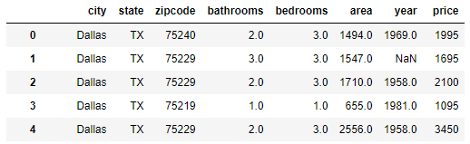

## Data Preprocessing
After scraping the data, cleaning is necessary before moving forward. I made the following changes:
* Removed irrelevant variables and kept 8 variables from the original scraped data
* Merged satellite cities records into parent cities
* Merged separate datasets from 4 citie into one

## EDA
### Basic stats of the variables
Median values of the variables

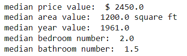

### Missing values
There are significant amount of missing values in the dataset. Some very serious feature engineering will be needed later

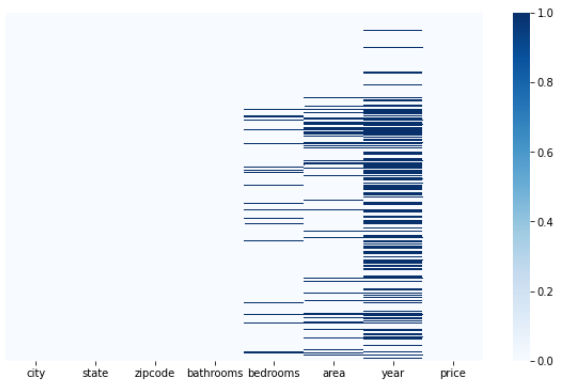

### Linear model assumptions
Even before outlier removal, it shows a pretty linear relationship between price and area

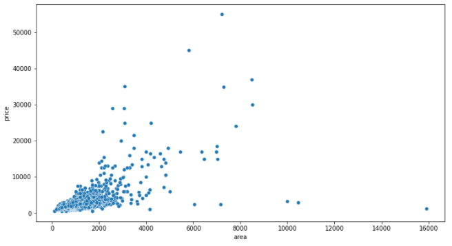

### Outlier
Some variables are extremely skewed, and in fact, most of the extremely large values are irrelevant to our purpose (which is to predict the apartment rent price for young professionals), thus it makes sense to consider those as outliers and remove them

"Price" (histogram + Q-Q plot + boxplot)  - very skewed

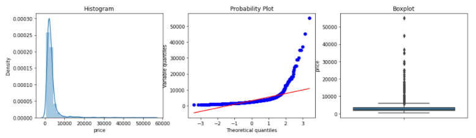

"area" - very skewed

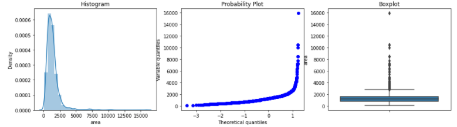

### Something interesting
Median price per city (Dallas < Seattle < Los Angeles < San Francisco)

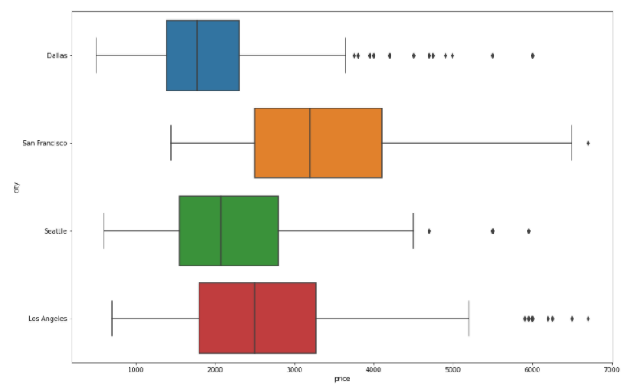

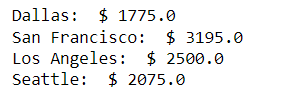

Small apartments mostly for young working professionals (1B1B) - Dallas is much more young people-friendly

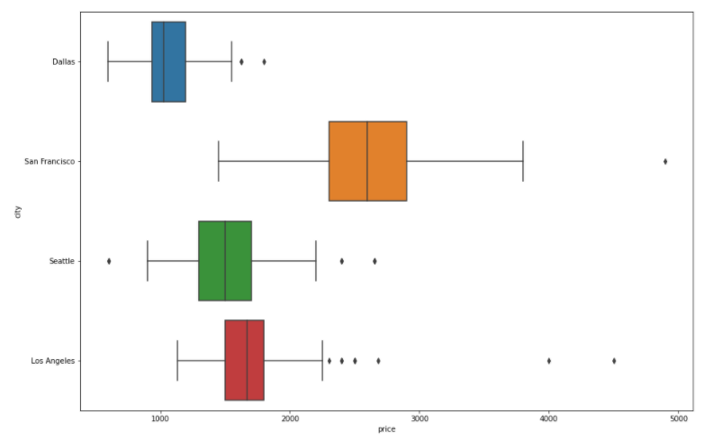

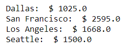

## Feature Engineering
### Rare label grouping
"zipcode": There are 132 different zipcodes, and most of them are well below 2% of the dataset, therefore, a grouping of the rare labels is necessary for the purpose of train test split and future model training

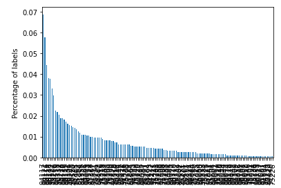

The relationship between the percentage of the zipcode and price: a linear relationship is showing when percentage increases; the cutoff is at around 2%

Therefore, I decided to group all the labels that are under 2%; and for the labels that are over 2%, I decided to use target-guided encoding, that creates a monotonic relationship between the target and predictor, which is ranked against the median target value

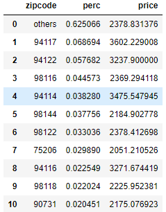

Target-guided encoding - ranked by median price from low to high

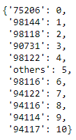

### Missing values imputation
4 variables have missing values. Majority are over 5%, and don't overlap, therefore, a Complete Case Analysis would cause significant data loss

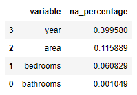

I decided to use the following strategies for missing values imputation:
* "bedrooms" & "bathrooms": mean imputation
* "area": median imputation
* "year": mode imputation

### Categorical variable variable encoding
Since each of the 4 cities have pretty distinct difference in median price, therefore, it makes sense to implement target-guided encoding - encoding by their ranking in median price, to create a monotonic relationship

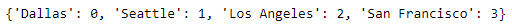

### Outlier trimming
I decided to trim data that are outside of 2 IQR

Data look better after trimming, though still not entirely linear

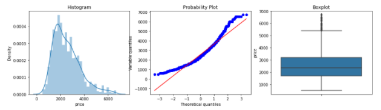

### Numeric variable transformations
I log transformed all numeric values to normalize numeric variables, which did a very good job

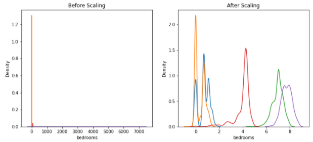

### Feature scaling
Because certain algorithms are sensitive to scales, such as linear regression and SVR, feature scaling is necessary. I decided to use standardization, which did a very good job to bring variables to similar scale

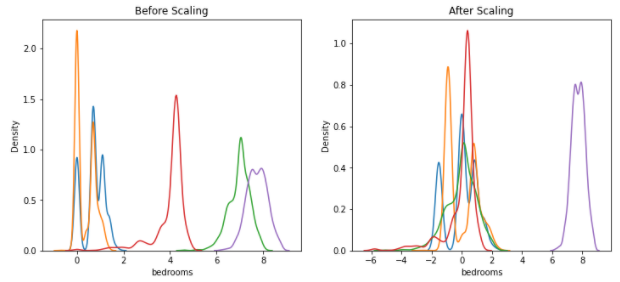

The linear relationship is well-preserved after scaling as well

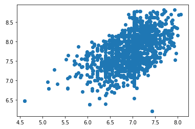   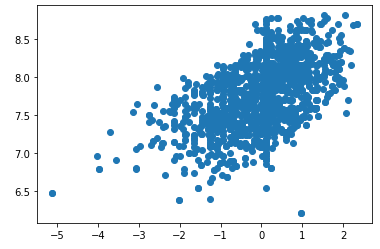

### Model Building
I tried several models and evaluated them using Root Mean Square Error and R squared, and at the end optimize the models using GridSearchCV

Models
* Multiple Linear Regression
* Regularization: Lasso Regression
* Regularization: Ridge Regression
* Support Vector Regression
* Decision Tree Regression
* Random Forest

### Model Performance
The Random Forest model far outperformed the other models
* Multiple Linear Regression, RMSE: 699; R squared: 0.661
* Regularization: Lasso Regression, RMSE: 704; R squared: 0.656
* Regularization: Ridge Regression, RMSE: 699; R squared: 0.661
* Support Vector Regression, RMSE: 655; R squared: 0.702
* Decision Tree Regression, RMSE: 673; R squared: 0.685
* Random Forest, RMSE: 541; R squared: 0.796
